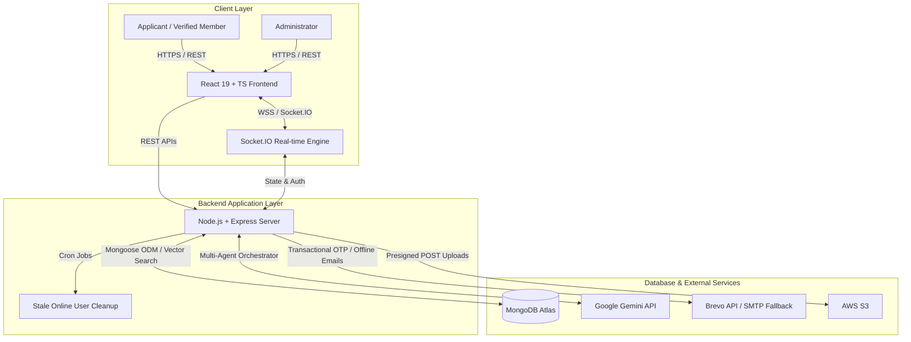
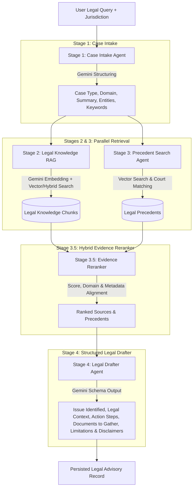

# Conversa

**Enterprise AI-powered verified community platform with real-time messaging, directory privacy, community inbox, and multi-agent RAG legal advisory.**

[](#project-status)
[](#technology-stack)
[](#technology-stack)
[](#technology-stack)
[](#technology-stack)

**Live Application:** [conversa-nu-taupe.vercel.app](https://conversa-nu-taupe.vercel.app/)

---

## Overview

Conversa is a full-stack, production-grade application engineered for verified membership communities. Beyond standard chat apps, Conversa unifies controlled membership onboarding, real-time messaging, directory privacy management, shared community discussions, and an advanced **4-Stage Multi-Agent AI Legal Advisory System**.

### Why Conversa?
Traditional organizations suffer from fragmented operations: member applications handled in manual forms, contact info leaked in uncontrolled spreadsheets, scattered discussion channels, and lack of domain-aware AI assistance. Conversa addresses these problems by providing:

- **Controlled Onboarding**: Admin review, automated Member ID generation, and email OTP verification.
- **Server-Side Privacy Engine**: Member-controlled visibility settings enforced at the database projection layer.
- **Real-Time Communication**: Multi-device Socket.IO chat, presence tracking, read receipts, and offline email alerts.
- **Personal AI Assistant**: Dedicated streaming Gemini AI chat with memory rollback capabilities.
- **Multi-Agent Legal Advisory**: A 4-stage RAG pipeline that processes complex legal queries into structured legal counsel, complete with relevant statutory knowledge and precedent citations.
- **Community Inbox**: Threaded discussions, category tagging, search, and admin moderation.
- **Administrative Operations Suite**: Audit logs, security event logs, member status controls, and emergency broadcast alerts.

---

## Architecture

### System Architecture Diagram



---

## Core User Journeys & System Workflows

### 1. Membership Onboarding & Activation Workflow

```text
Applicant submits membership form (/apply)
                   ↓
Application created with PENDING state & tracking code
                   ↓
Administrator reviews application in Admin Console
          ↓                         ↓
       Approve                   Reject
          ↓                         ↓
System assigns Member ID    Status set to REJECTED
& sends activation email
          ↓
Applicant visits activation portal (/activate)
          ↓
Email OTP verification (5-min expiry, bcrypt hashed)
          ↓
Account activated → User becomes verified ACTIVE member
          ↓
Full access granted to Directory, Chat, Community Inbox & AI Advisory
```

### 2. Real-Time Socket.IO Messaging & Presence Workflow

- **Authenticated Handshake**: Socket connections authenticate using JWT (`handshake.auth.token`).
- **Multi-Device Tracking**: `userSocketMap` maintains a `Map<userId, Set<socketId>>`. A member is marked offline only when their final socket disconnects.
- **Message Features**: Supports text, presigned S3 image attachments, quoted replies (`replyTo`), soft-deletes (`delete for everyone`), hard-deletes (`delete for me`), starred messages, and read receipts (`seenBy`).
- **Offline Email Fallback**: When a message is sent to an offline recipient (no active sockets), a fire-and-forget branded HTML notification email is delivered via Nodemailer / Brevo API.

### 3. Personal Gemini AI Assistant Workflow

- Upon user registration, a personal AI bot user and private conversation are initialized automatically.
- User messages trigger Google Gemini streaming generation over Socket.IO (`bot-chunk`, `bot-done`).
- Maintains a rolling 19-message conversation memory window.
- Handles generation failures gracefully with automatic message rollback (`bot-error`).

### 4. Multi-Agent Legal Advisory AI System (4-Stage RAG Pipeline)



#### Detailed Pipeline Execution:
1. **Stage 1 (Case Intake Agent)**: Analyzes the raw query to identify jurisdiction, legal domain (e.g., Constitutional, Criminal, Corporate), case type, key entities, and core search keywords.
2. **Stage 2 (Legal Knowledge RAG)**: Generates query embeddings using `@google/genai` (`text-embedding-004`) and queries MongoDB Atlas Vector Search over `LegalKnowledgeChunk` documents.
3. **Stage 3 (Precedent Search Tool)**: Performs vector and keyword lookup across `LegalPrecedent` records to extract relevant case law, judgements, and court rulings.
4. **Stage 3.5 (Evidence Reranker)**: Normalizes vector similarities, calculates domain matching weights, and reranks evidence items to maximize context precision.
5. **Stage 4 (Legal Drafter Agent)**: Synthesizes intake analysis, top legal chunks, and precedent citations into a structured legal advisory response containing actionable steps, required evidence, risk limitations, and formal disclaimers.

### 5. Community Directory & Privacy Engine Workflow

- Directory offers full-text search by name, Member ID, location, occupation, and education, alongside filters for city, state, blood group, and occupation.
- Server-side privacy projection ensures sensitive fields (email, phone, organization, education, blood group, community details) are hidden based on each member's custom `privacySettings`.

### 6. Community Inbox & Admin Moderation Workflow

- Members create community posts with category tags, text content, and attachments.
- Supports threaded reply discussions and real-time inbox updates over Socket.IO.
- Admin moderation capabilities: pin posts, hide inappropriate content, restore posts, and delete violations.

### 7. Administrative Suite & Security Systems

- **Role-Aware Security**: Protected admin routes (`/admin/*`) guarded by JWT role verification (`ADMIN`).
- **Audit & Security Logging**: Writable event logs for compliance (`AuditLog`) and security event tracking (`SecurityLog`).
- **Emergency Broadcasts**: System-wide emergency alerts dispatched by administrators (`EmergencyBroadcast`).
- **Auto-Seeding**: Automatic initialization of default admin credentials on application startup if configured in environment variables.

---

## Technology Stack

| Layer | Technology |
|---|---|
| **Frontend** | React 19, TypeScript, Vite 7, Tailwind CSS v4, shadcn/ui, React Router v7 |
| **Backend** | Node.js, Express.js 4 |
| **Database** | MongoDB Atlas, Mongoose 8 |
| **Search / RAG** | MongoDB Vector Search, Gemini `text-embedding-004` |
| **Real-time** | Socket.IO 4 (Server & Client) |
| **Authentication** | JWT (jsonwebtoken), Email OTP, bcryptjs |
| **AI Services** | Google Gemini API (`@google/genai`) |
| **Media Storage** | AWS S3 (pre-signed POST URL direct browser uploads) |
| **Email Delivery** | Nodemailer / Brevo Transactional Email API |
| **Testing** | Jest |
| **Containerisation** | Docker, Docker Compose |

---

## Data Models Summary

- **`User`**: Account identity, auth credentials, Member ID, role (`MEMBER` / `ADMIN`), status (`PENDING`, `ACTIVE`), presence flags, privacy preferences (`privacySettings`), blocked users, and pinned conversations.
- **`MembershipApplication`**: Registration submissions awaiting admin review (`applicantName`, `email`, `phone`, `status`, `rejectionReason`).
- **`Conversation`**: Chat container storing `members`, `latestmessage`, and `unreadCounts`.
- **`Message`**: Individual message storing `senderId`, `text`, `imageUrl`, `replyTo`, `seenBy`, `hiddenFrom` (delete for me), `softDeleted` (delete for everyone), and `starredBy`.
- **`CommunityPost`**: Shared inbox posts with `title`, `content`, `category`, `author`, `isPinned`, `isHidden`, `viewsCount`, and `repliesCount`.
- **`CommunityReply`**: Threaded replies attached to `CommunityPost`.
- **`LegalAdvisory`**: Saved legal advisory sessions storing original query, intake output, retrieved RAG sources, precedents, draft responses, and execution statuses (`ragSearchStatus`, `precedentSearchStatus`).
- **`LegalKnowledgeChunk`**: Domain knowledge chunks storing text, metadata, legal domain, source reference, and vector embedding array.
- **`LegalPrecedent`**: Court judgments and precedents storing case title, citation, legal domain, ruling summary, and vector embedding array.
- **`AuditLog`**: Administrative action logs (`adminId`, `action`, `targetType`, `targetId`, `metadata`).
- **`SecurityLog`**: Security event tracking (`eventType`, `ipAddress`, `userId`, `details`).
- **`EmergencyBroadcast`**: Community emergency alerts (`title`, `message`, `severity`, `isActive`, `createdAdminId`).

---

## REST API Reference

All protected endpoints require `auth-token: <JWT>` in the HTTP request headers.

### Authentication (`/auth`)
| Method | Path | Auth Required | Description |
|---|---|---|---|
| `POST` | `/auth/register` | No | Direct registration (creates user, bot, conversation) |
| `POST` | `/auth/login` | No | Login via Password or OTP |
| `POST` | `/auth/getotp` | No | Request login OTP via email |
| `GET` | `/auth/me` | Yes | Get authenticated user profile |
| `POST` | `/auth/send-verification-otp` | Yes | Request email verification OTP |
| `POST` | `/auth/verify-email` | Yes | Verify email OTP and mark user verified |

### Application & Activation (`/application`, `/activation`)
| Method | Path | Auth Required | Description |
|---|---|---|---|
| `POST` | `/application/apply` | No | Submit public membership application |
| `GET` | `/application/status/:code` | No | Check application status via tracking code |
| `POST` | `/activation/request-otp` | No | Request 6-digit OTP for membership activation |
| `POST` | `/activation/verify-otp` | No | Verify OTP and set password to activate member account |

### Real-Time Messaging (`/message`, `/conversation`)
| Method | Path | Auth Required | Description |
|---|---|---|---|
| `POST` | `/conversation` | Yes | Get or create a 1-to-1 conversation |
| `GET` | `/conversation` | Yes | List conversations (pinned first, sorted by update date) |
| `GET` | `/conversation/:id` | Yes | Fetch conversation details |
| `POST` | `/conversation/:id/pin` | Yes | Toggle conversation pin status |
| `GET` | `/message/starred` | Yes | Get all starred messages for authenticated user |
| `GET` | `/message/:id` | Yes | Fetch message history for a conversation |
| `DELETE` | `/message/bulk/hide` | Yes | Bulk hide messages for self |
| `DELETE` | `/message/:id` | Yes | Delete message (`scope: "me" \| "everyone"`) |
| `POST` | `/message/clear/:conversationId` | Yes | Clear chat history for self |
| `POST` | `/message/:id/star` | Yes | Toggle message star bookmark |

### Member Directory & Profile (`/directory`, `/user`)
| Method | Path | Auth Required | Description |
|---|---|---|---|
| `GET` | `/directory/search` | Yes | Search & filter active member directory (privacy projected) |
| `GET` | `/directory/member/:memberId` | Yes | Get single member profile by Member ID |
| `PUT` | `/user/update` | Yes | Update profile, password, privacy settings, notification preferences |
| `GET` | `/user/presigned-url` | Yes | Obtain S3 pre-signed POST URL for profile picture upload |
| `POST` | `/user/block/:id` | Yes | Block target user |
| `DELETE` | `/user/block/:id` | Yes | Unblock target user |
| `GET` | `/user/non-friends` | Yes | Discover users without active conversations |
| `DELETE` | `/user/delete` | Yes | Soft-delete and anonymize user account |

### Multi-Agent Legal Advisory (`/api/legal-advisory`)
| Method | Path | Auth Required | Description |
|---|---|---|---|
| `POST` | `/api/legal-advisory/analyze` | Yes | Submit query to 4-stage AI legal advisory pipeline |
| `GET` | `/api/legal-advisory/health/data` | Admin | Check database vector collection health counts |

### Community Inbox (`/inbox`)
| Method | Path | Auth Required | Description |
|---|---|---|---|
| `GET` | `/inbox/posts` | Yes | List community posts with filtering & pagination |
| `POST` | `/inbox/posts` | Yes | Create new community post |
| `GET` | `/inbox/posts/:postId` | Yes | Get post details and reply thread |
| `POST` | `/inbox/posts/:postId/replies` | Yes | Reply to community post |

### Admin Console (`/admin`, `/admin/inbox`)
| Method | Path | Auth Required | Description |
|---|---|---|---|
| `POST` | `/admin/login` | No | Admin login authentication |
| `GET` | `/admin/applications` | Admin | List pending/processed membership applications |
| `POST` | `/admin/applications/:id/approve` | Admin | Approve application & trigger invitation |
| `POST` | `/admin/applications/:id/reject` | Admin | Reject application with reason |
| `GET` | `/admin/members` | Admin | List active members and status controls |
| `GET` | `/admin/audit-logs` | Admin | Retrieve administrative audit trail |
| `GET` | `/admin/security-logs` | Admin | Retrieve security event logs |
| `POST` | `/admin/emergency/broadcast` | Admin | Send emergency broadcast message |
| `PUT` | `/admin/inbox/posts/:id/pin` | Admin | Pin/unpin community inbox post |
| `PUT` | `/admin/inbox/posts/:id/hide` | Admin | Hide/restore community inbox post |

---

## Socket.IO Real-Time Events

| Event Name | Direction | Payload Description |
|---|---|---|
| `setup` | Client → Server | Join personal socket room and update online status |
| `join-chat` | Client → Server | Join active conversation room, reset unread counter, send read receipts |
| `leave-chat` | Client → Server | Join/leave conversation room |
| `send-message` | Client → Server | Send chat message or trigger AI bot stream |
| `delete-message` | Client → Server | Request message deletion (`me` or `everyone`) |
| `typing` | Client → Server | Broadcast typing indicator to conversation room |
| `stop-typing` | Client → Server | Broadcast stop-typing indicator |
| `receive-message` | Server → Client | Deliver new message to active chat room |
| `new-message-notification` | Server → Client | In-app notification sent to recipient's personal room |
| `messages-seen` | Server → Client | Notify sender that messages were marked as read |
| `message-deleted` | Server → Client | Broadcast tombstone update for deleted message |
| `bot-chunk` | Server → Client | Stream Gemini AI response text chunk |
| `bot-done` | Server → Client | Signal AI stream completion with final Message document |
| `bot-error` | Server → Client | Signal AI error and prompt UI rollback |

---

## Environment Configuration

Copy `.env.example` to `.env` in `backend/` and `frontend/`:

### Backend Environment Variables (`backend/.env`)

| Variable | Required | Description |
|---|---:|---|
| `PORT` | No | Server port (default: `5500`) |
| `MONGO_URI` | **Yes** | MongoDB connection string |
| `MONGO_DB_NAME` | No | MongoDB database name |
| `JWT_SECRET` | **Yes** | Secret key for signing JWT tokens |
| `GEMINI_API_KEY` | **Yes** | Google Gemini API Key |
| `GEMINI_MODEL` | No | Gemini model identifier (default: `gemini-2.5-flash`) |
| `EMAIL` | **Yes** | SMTP Sender Email / Brevo API User |
| `PASSWORD` | **Yes** | SMTP App Password / Brevo API Key |
| `FRONTEND_URL` | No | Frontend URL for email deep-links (default: `http://localhost:5173`) |
| `CORS_ORIGIN` | No | Allowed CORS origin (default: `*`) |
| `AWS_BUCKET_NAME` | No | AWS S3 Bucket name for media uploads |
| `AWS_ACCESS_KEY` | No | AWS IAM Access Key ID |
| `AWS_SECRET` | No | AWS IAM Secret Access Key |
| `AWS_REGION` | No | AWS Region (e.g. `ap-south-1`) |
| `ADMIN_EMAIL` | No | Default admin email for auto-seeding |
| `ADMIN_PASSWORD` | No | Default admin password for auto-seeding |

### Frontend Environment Variables (`frontend/.env`)

| Variable | Required | Description |
|---|---:|---|
| `VITE_API_URL` | **Yes** | Public backend API URL (e.g. `http://localhost:5500`) |

---

## Local Setup & Quick Start

### Prerequisites
- Node.js ≥ 20
- npm
- MongoDB instance (MongoDB Atlas required for Vector Search functionality)
- Git

### 1. Clone & Configure
```bash
git clone https://github.com/theSinghKirti/conversa.git
cd conversa/conversa-main
```

### 2. Backend Setup
```bash
cd backend
npm install
cp .env.example .env
# Edit .env and supply MONGO_URI, JWT_SECRET, GEMINI_API_KEY, EMAIL, etc.
npm run dev
```

### 3. Frontend Setup
```bash
cd ../frontend
npm install
cp .env.example .env
# Ensure VITE_API_URL points to http://localhost:5500
npm run dev
```

### 4. Vector Knowledge Ingestion (Optional for Legal AI)
To ingest sample legal knowledge chunks and court precedents for the 4-stage RAG system:
```bash
cd ../backend
node scripts/ingest-legal-knowledge.js
node scripts/ingest-legal-precedents.js
```

---

## Docker Deployment

Deploy the full stack (MongoDB + Express Backend + React Nginx Frontend) using Docker Compose:

```bash
cd conversa-main
docker compose up --build -d
```

- **Frontend**: `http://localhost`
- **Backend API**: `http://localhost:5500`
- **MongoDB**: `localhost:27019`

---

## License

MIT — see [LICENSE](file:///c:/Users/itisa/Desktop/conversa-main/conversa-main/LICENSE) for details.
